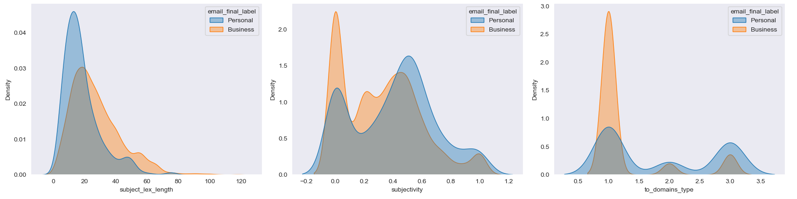

# Informal Language in Corporate Email Communication (Business/Personal)

Code for 'Effective methods for Email Classification: Is it a Business or Personal Email?' 

URL for the paper 

Milena Šošić pd202030@alas.matf.bg.ac.rs

Jelena Graovac jgraovac@matf.bg.ac.rs


## Data 

The [Enron Corpus](https://www.cs.cmu.edu/~./enron/) is a database of over 600,000 emails generated by 158 employees of the 
Enron Corporation. It is widely used mail corpus for scientific research in this domain. 
For Business/Personal email classification problem, we need corpus of annotated mails with specified categories. For that purpose, we have collected two, independently annotated data sets:

Enron database, retrieved December, 2020 from: http://www.cs.columbia.edu/~vinod/data/gender_identified_enron_corpus.tar.gz

Personal vs business annotations, University of Columbia, retrieved December, 2020 from: http://innovation.columbia.edu/technologies/CU19154_automatic-email-classification
To get Columbia annotated data set, please contact the authors.

[Berkeley Enron](https://bailando.berkeley.edu/enron_email.html) annotations, University of Berkeley of about 1700 labeled email 
messages. These annotations contains 53 topic categories which are merged into Business/Personal classes for this project requirement as it follows:
- Personal: Purely Personal, Personal in professional context and Private humor
- Business: all other categories which are related to business policies, strategy, legal notes or regulations


## Problem Statement

The goal of the project is to develop classification procedure for Business/Personal email classification. 
It is not always obvious to which of these categories an email belongs as there could be mixed level of information shared within it.
Identifying and understanding informal communication in business environments could help the business stakeholders to effectively organize their following activities.


## How to use the code

Run `pipeline.py` script with different arguments for data preprocessing, features extraction, text representation and model building:

``` 
python -u pipeline.py \
    --train_id $TRAIN_ID \
    --test_id $TEST_ID \
    --experiment $EXPERIMENT \
    --vector_type $VECTOR_TYPE \
    --feature_type $FEATURE_TYPE \ 
    --preprocess $PREPROCESS \
    --lemmatize $LEMMATIZE \
    --stop_words $STOP_WORDS \
    --visualize $VISUALIZE
```
Set:
- `--train_id` argument to [berkeley, columbia] for train data selection
- `--test_id` argument to [berkeley, columbia] for test data selection
- `--experiment` argument to [E, ED, EQ, EQD, B] for emails, emails with domains, emails with quotes, email with quotes and domains and email thread arc experiments respectively
- `--vector_type` argument to [BOW, TFIDF, EMBD, META] to select emails vector representation
- `--feature_type` argument to [LEX, CONV, RDY, EMO, MOR, EXP, NER, ALL] to select set of meta features
- `--preprocess` argument to [true, false] for data preprocessing and features extraction
- `--lemmatize` argument to [true, false] to lemmatize words during preprocessing
- `--stop_words` argument to [true, false] to remove stop words during preprocessing
- `--visualize` argument to [true, false] to visualize dataset (features distribution, characteristic words per class, email length distribution)

- `root_dir` variable to the path of the project location in the `constants.py` file.
- All other settings in the `constants.py` file
- Data files in the .csv format into the `root_dir/data` directory

Alternatively, workflow could be run using  `bash/pipeline.sh` script with the same set of arguments.

## Code organization structure
Directories:

- `/bash` - bash scripts for running pipeline.py and bert_experiments.py python scripts
- `/data` - original labeled data files in .csv format and data preprocessed files
- `/exploration` - scripts for visualization and parameter search for traditional models (SGD-SVM, ExtraTrees)
- `/lexicons` - morality, business related words, free email domains and personal names lexicons
- `/modeling` - scripts for creation and building traditional and deep learning models
- `/models` - models created during experiments (.sav extension for tradional and .saved_models for
  deep learning models)
- `/preprocess` - scripts for data preprocesing, features creation and normalization
- `/results` - comparable results of models building, validation and testing for different experiments 
  for established metrics and plots for visualization
- `/text` - scripts for different ways of text representation - BoW, Tf-Idf and Embeddings vectors


## Text Pre-Processing

First major step is to pre-process the raw data by using `preprocess=true` as an argument. 

It contains various html and urls links, NER tags, punctuations, newlines, single letter alphabets and stopwords which provide much information regarding the context of conversation. 

Following steps are performed during preprocessing:

1. Extract last email from the thread arc

2. Extract quotation messages and splitters

3. Remove emails with empty content

4. Calculate additional features from the experiment content

## Feature Engineering

Following groups of features are identified and created:

1. Lexical & Syntactical - extract various features using nltk and textstat libraries
2. Conversational - Free email domains library: https://github.com/willwhite/freemail
3. Expressional 
   - Sentiment: https://textblob.readthedocs.io/en/dev/; 
   - Readability: https://pypi.org/project/textstat/
4. Emotional Affect - https://pypi.org/project/NRCLex/
5. Moral Intuitions - https://github.com/medianeuroscience/emfd



Preprocessed data files for additional features are saved in the project `data` directory with the extension `_features.csv`.
With the prepocessed data files in place, we are able to perform experiments on different email content representations and features selection.

## Text Cleaning

For each experiment, we are performing following steps to clean the data and prepare it for modeling:

1. Remove all punctuations, white spaces and personal names using regex expressions and lexicons

2. Remove url links and emails from mail content

3. Lowercase all the words present in the text

4. Remove stopwords and lemmatize remaining words (optional)

5. Calculate Bow, Tf-Idf and BERT Embeddings token weights over the preprocessed and cleaned dataset setting max_features= 10000, min_df=2 and 
   max_df=0.9 (words appearing in less than 2 and in more than 90% of text are removed)

6. Split the data using train_test_split functionality from sklearn.model_selection library with 75/25 ratio 
   and apply different traditional and deep learning algorithms for models evaluation and final prediction 

## Model Building

### Traditional models

Following traditional algorithms are selected for experimentation:

1. SVG-SVM
2. ExtraTrees

which are built and evaluated on BoW, Tf-Idf, BoW+Meta, Tf-Idf+Meta text representations.

### Deep Learning models 

There are selected following deep learning algorithms for experimentation:

1. BiLSTM
2. BILSTM + Attention layer
which are built and evaluated on BERT-Embeddings and BERT-Embeddings + Meta text representations.

Steps performed: 

1. Tokenize the text. Every document will be converted into a sequence of words identified by their token number. 
   To do this, we will use Tokenizer from keras.preprocessing.text. Length of vocab for BERT models is set to 30522. 

2. Define input length for the embedding layer. Here we will calculate the length at various percentiles. 
   Input length of 256 is default.

3. Reshape target variable 

4. Create sequential model containing embedding, Bidirectional-LSTM, Attention and Dense Layers.

5. Compile the model using "adamW" optimizer, loss='binary_crossentropy' and "binary_accuracy" as a metric.

7. Train the model


### Top performing models

- SGD-SVM + Tf-Idf-Ngram + Meta gives the best accuracy score of:
  - 92.9% on emails content with domains (ED) content classification experiment 
  - 95.8% on emails content with quotations and domains (EQD) content classification experiment 
which outperforms results presented in the SoA papers published on this task. 

## Suggestions for further improvements

1. Collect additional labeled email and other conversational datasets from business environments

2. Experiment with different deep learning model architectures and text embeddings (sentence)

3. Experiment with the approach in the multi-lingual and cross-lingual context

4. Perform model search over hyper-parameters to get the most optimized set of hyper-parameter values - https://github.com/google/model_search

5. Perform multiclass classification on fine-grained Buisness/Personal sub-categories


